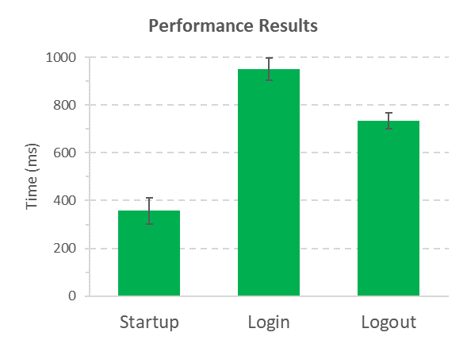

# playwright-performance



To ensure that your application is responsive and performing optimally, it is important to monitor the apparent response time of key procedures. Apparent response time is defined as the time it takes for a procedure to complete and make the application available to the user.
With this [Playwright](https://playwright.dev/) plugin, you can easily add performance analysis to any flow in your tests, whether it's a pure UI, API, or a combination of both. This plugin provides a simple and efficient way to measure the response times of various procedures and identify potential bottlenecks in your application. With this information, you can make informed decisions about optimizations and improvements to enhance the overall performance of your application. Read more [here](https://www.linkedin.com/pulse/elevating-your-playwright-tests-plugin-tzur-paldi-phd).

## Installation

You can install this module as a dev-dependency using the following command:

```bash
npm install playwright-performance --save-dev
```

## Major update: Version 2.x.x

>### ❗❗❗Breaking Changes❗❗❗
>
>This release includes significant changes that may affect your existing implementations. Please read the following instructions carefully to ensure a smooth transition.
>
>### Import and extending Playwright test
>
>We have simplified the way you import and extend the Playwright `test` in this version. Make sure to follow these new instructions to properly set up your tests.

## Usage

Import playwright-performance in your test file as follows:

```typescript
import extendPlaywrightPerformance, {PerformanceOptions, PerformanceWorker, PlaywrightPerformance} from "playwright-performance"; 
```

### Usage in test

To use playwright-performance, simply import the playwright-performance object and types, and then extend your test object using test.extend<>(). This will include the performance functionality in your test. No further setup is required. Here's an example:

```typescript
import { test as base, expect } from '@playwright/test';
import extendPlaywrightPerformance, {PerformanceOptions, PerformanceWorker, PlaywrightPerformance} from "playwright-performance"; 

const test = base.extend<PlaywrightPerformance, PerformanceOptions & PerformanceWorker>(extendPlaywrightPerformance());

test('startup performance', async ({ page, performance }) => {
    performance.sampleStart("GH-startup");
    await page.goto('http://github.com/');
    performance.sampleEnd("GH-startup");

    performance.sampleStart("SF-startup");
    await page.goto('https://sourceforge.net/');
    performance.sampleEnd("SF-startup");
  });
```

>❗
>It is advisable to define the extended `test` object in a separate, reusable `test-base` file
>👍

You can also get the time span for a single sample inside a test:

```typescript
it("should test github startup performance", () => {
            performance.sampleStart("Startup");
            browser.url("https://github.com/");
            performance.sampleEnd("Startup");

            expect(performance.getSampleTime("Startup")).to.be.at.most(1000);         
        });
```

### Options

You can override the default options values in the `performanceOptions` fixture object as follows:

```typescript
const options: PerformanceOptions = {
  // Specify only the options you need. Unspecified options will use default values.
  disableAppendToExistingFile: false,  // Optional: Default is false
  dropResultsFromFailedTest: false,    // Optional: Default is false
  analyzeByBrowser: false,             // Optional: Default is false
  performanceResultsDirectoryName: "performance-results", // Optional: Default is "performance-results"
  performanceResultsFileName: "performance-results",      // Optional: Default is "performance-results"
  suppressConsoleResults: false,       // Optional: Default is false
  recentDays: 0,                       // Optional: Default is 0
};

const test = base.extend<PlaywrightPerformance, PerformanceOptions & PerformanceWorker>(extendPlaywrightPerformance(options));
```

#### __disableAppendToExistingFile__

When set to `false` (default), performance data will be added to the existing data.

When set to `true`, new test runs will start fresh and overwrite any existing performance data.

> **⚠️ Caution:**
>
> This action will delete all your performance data permanently. Ensure that you have a backup before proceeding.

#### __performanceResultsFileName__

You can set the default results file name (`performance-results`).
A newly created results file normally overwrites the old file. If you want to keep old files, it is recommended to add a timestamp to the file name. For example:

```typescript
...
performanceResultsFileName: `performance-results_${new Date().getHours()}`
...
```

#### __dropResultsFromFailedTest__

Default is `false`. When the value is set to `true`, performance analysis from failed tests would be excluded.

#### __performanceResultsDirectory__

You can override the default path for the results directory in the project's root dir.
For example:

```typescript
...
performanceResultsFileName: "results-dir/performance-total-results"
...
```

#### __analyzeByBrowser__

Default is `false`. If true, the performance data would be grouped also by the browser type.

#### __suppressConsoleResults__

Default is `false`. If true, the performance results won't be printed to the terminal log.

#### __recentDays__

Default is `0` feature is off. For any value greater than zero, only the result from the recent designated days would be analyzed. This value can be integer or decimal (e.g. 1 for recent 1 day, 0.5 for recent half day etc.). Please note that the option _disableAppendToExistingFile_ must be set to `false` (default value) in order to use this option.

## Getting the results

A new directory named `performance-results` (or a different specified name) is created inside your project's root folder. Once all the tests are completed, two files are created inside the performance-results directory: `performance-results.json` and `performance-results.csv`. The analyzed data includes average time, standard error of mean (SEM), number of samples, minimum value, maximum value, earliest time, and latest time. The results table is also printed to the terminal log.

### Analyzing performance data in bulk

To analyze existing performance data in bulk without generating new tests, it is recommended to use the [__performancetotal-cli__ tool](https://www.npmjs.com/package/performancetotal-cli).

## Typescript support

Typescript is supported for this plugin.

## Support

For any questions or suggestions contact me at: [tzur.paldi@outlook.com](mailto:tzur.paldi@outlook.com?subjcet=Playwright-cleanup%20Support)